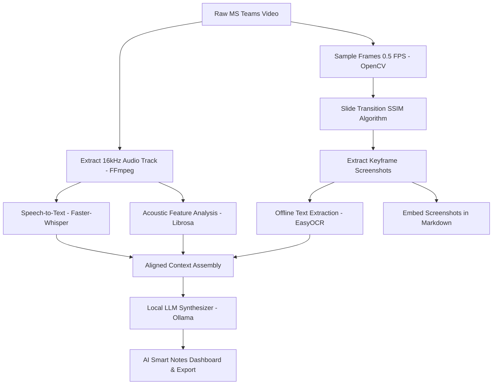

# 🎙️ EchoNotes AI - Multimodal Video Lecture Synthesizer

> **A cutting-edge local AI application tailored for Bosch Digital Academy.**
> EchoNotes AI automatically transcribes long video recordings (MS Teams/Zoom), detects slide transitions via computer vision, isolates key vocal emphasis moments using acoustic signal processing, and synthesizes them into highly structured **AI Smart Notes** with embedded screenshots using local LLMs.

---

## 🗺️ System Architecture

EchoNotes AI implements an optimized parallel multimodal pipeline entirely locally on your machine, leveraging CPU and GPU hardware acceleration:



---

## ✨ Features & Technologies

### 1. Speech & Audio Intelligence
- **Faster-Whisper (CTranslate2):** Up to 4x faster speech-to-text with word-level timestamps, optimized for local CUDA execution on NVIDIA graphics card.
- **Librosa Acoustic Analytics:** Calculates **Pitch (F0 contour via YIN)** and **Loudness (RMS Energy)** in real-time. Matches vocal inflection with transcripts to highlight critical warnings, exam tips, or teacher announcements automatically.
- **Adaptive Speech Rate:** Estimates words-per-second (WPS) to capture slow, deliberate explanations (teacher explaining core models/diagrams).

### 2. Computer Vision Slide Parsing
- **SSIM (Structural Similarity Index):** Compares downsampled gray frame buffers at 0.5 FPS to capture keyframe slides instantly, bypassing memory bloat on 3-hour recordings.
- **Dual-Language EasyOCR:** Extracts English & Vietnamese text directly from captured slide frames to build semantic keywords for the LLM.

### 3. Smart GenAI Orchestrator (Local Ollama)
- **Local Ollama Integration:** Connects seamlessly to lightweight high-performance LLMs (such as `qwen2.5:7b-instruct` or `llama3:8b`).
- **Structured Synthesis:** Organizes notes automatically chronologically mapped to specific slides, embedding local screenshot images directly using markdown.

---

## 🛠️ Quick Start & Installation

### Prerequisites
1. **Python 3.10+** (Numpy compatible)
2. **FFmpeg** installed on your system PATH (required for high-performance audio extraction and video copy slicing).
3. **Ollama** installed locally (running on port `11434`).

### Setup Instructions

1. **Clone or navigate to the repository:**
   ```bash
   cd d:/GITHUB/EchoNotes-AI
   ```

2. **Create a Python Virtual Environment & Activate:**
   ```bash
   python -m venv venv
   # On Windows (PowerShell):
   .\venv\Scripts\Activate.ps1
   ```

3. **Install Dependencies:**
   ```bash
   pip install -r requirements.txt
   ```

4. **Prepare Local LLM:**
   Make sure Ollama is open and pull your model of choice (Qwen 2.5 7B is highly recommended for Vietnamese technical synthesis):
   ```bash
   ollama pull qwen2.5:7b-instruct
   ```

5. **Launch the Dashboard:**
   ```bash
   python run.py
   ```
   *The system will automatically verify local folders and launch the dashboard web UI at [http://localhost:8501](http://localhost:8501).*

---

## ⚡ Hardware Compatibility & Optimization

Tested on **ASUS TUF Gaming F16 (6GB VRAM, 16GB System RAM)**:
- **CUDA Acceleration:** Whisper models and EasyOCR will automatically utilize CUDA on your NVIDIA GPU to run transcription and slide text recognition instantly.
- **Memory footprint:** The pipeline processes long lectures using in-place chunking and downsampled frames to ensure it never exceeds the 16GB RAM threshold or causes Out-Of-Memory (OOM) GPU crashes.
